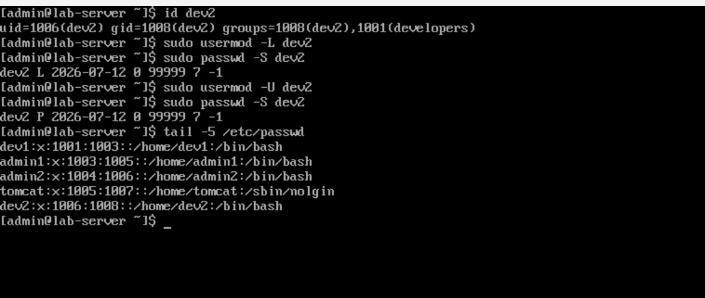

# Day 1: User & Group Management

## Objective
To learn the fundamental Linux commands for creating, modifying, and deleting users and groups.

## Commands Used
| Command | Description |
|---------|-------------|
| `sudo groupadd developers` | Created a group for developers. |
| `sudo groupadd admins` | Created a group for admins. |
| `sudo useradd -m -G developers dev1` | Created user `dev1` and added to `developers`. |
| `sudo passwd dev1` | Set password for `dev1`. |
| `sudo useradd -m -G developers dev2` | Created user `dev2` and added to `developers`. |
| `sudo passwd dev2` | Set password for `dev2`. |
| `sudo useradd -m -G admins admin1` | Created user `admin1` and added to `admins`. |
| `sudo passwd admin1` | Set password for `admin1`. |
| `sudo useradd -s /sbin/nologin -m tomcat` | Created service account `tomcat` with no login shell. |
| `sudo usermod -L dev2` | Locked the `dev2` user account. |
| `sudo passwd -S dev2` | Showed password status for `dev2`. |
| `sudo usermod -U dev2` | Unlocked the `dev2` user account. |
| `sudo userdel -r dev2` | Deleted `dev2` and their home directory. |

## Screenshots

## Key Takeaways
- `sudo` is required for user management commands.
- `usermod -L` locks a user account; `usermod -U` unlocks it.
- `passwd -S` shows the status of a user account (L = Locked, P = Password set).
- Service accounts should have `/sbin/nologin` to prevent login.

## Challenges Faced
- **Permission Denied:** When I tried to lock `dev2` without `sudo`, I got an error. I fixed it by using `sudo` to elevate privileges.
- **Understanding Output:** I learned that `passwd -S` shows `L` for locked and `P` for password set.
