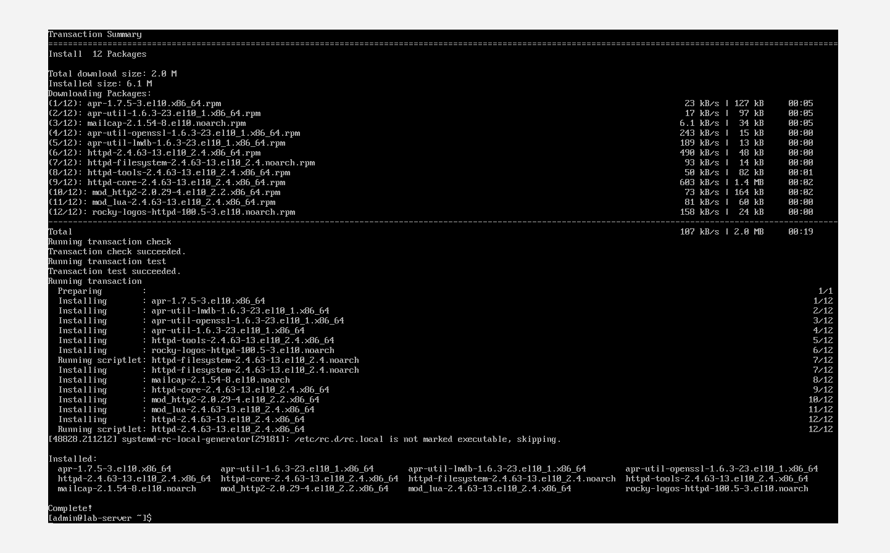
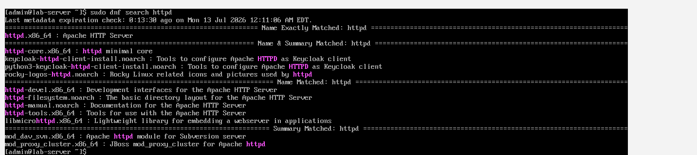
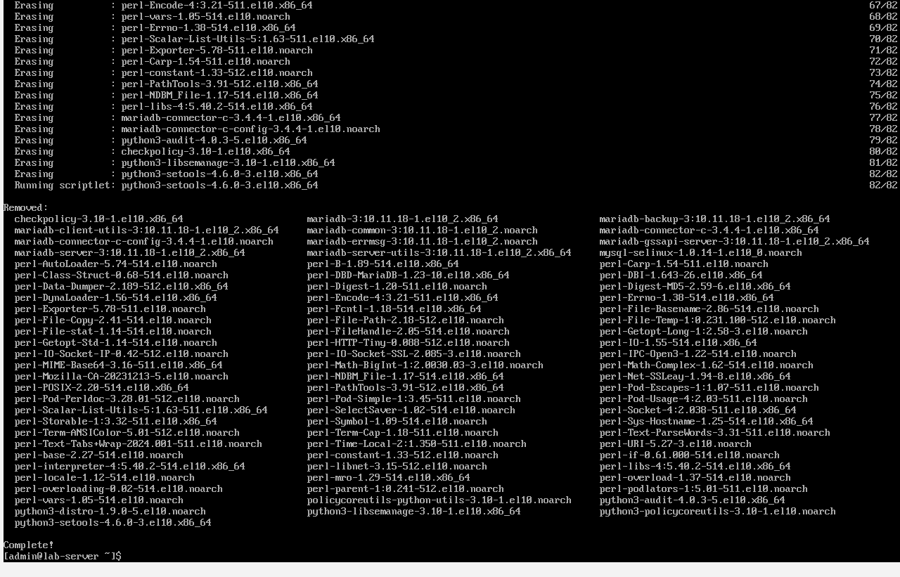

# Day 3: Package Management (DNF)

## Objective
To learn how to manage software packages using the DNF package manager — a core skill for any Linux SysAdmin.

---

## Commands Used

| Command | Description |
|---------|-------------|
| `sudo dnf check-update` | Check for available updates |
| `sudo dnf update -y` | Update all packages |
| `sudo dnf search httpd` | Search for a package |
| `sudo dnf info httpd` | Get detailed package information |
| `sudo dnf install -y httpd` | Install a package |
| `sudo dnf list installed` | List all installed packages |
| `sudo dnf history` | View package transaction history |
| `sudo dnf remove -y mariadb-server` | Remove a package |
| `sudo dnf clean all` | Clean package cache |
| `sudo dnf makecache` | Rebuild package cache |
| `sudo dnf repolist` | List active repositories |
| `sudo systemctl start httpd` | Start the web server |
| `sudo systemctl enable httpd` | Enable web server at boot |

---

## Screenshots

### 1. Package Installation

### 2. Package History

### 3. Package Removal

---

## Key Takeaways
- DNF resolves dependencies automatically.
- `dnf history` is useful for auditing and rollback.
- Always clean cache after a failed installation.
- `dnf makecache` refreshes the package list.
- Installed packages can be managed with `systemctl` to start/enable services.

---

## Challenges Faced
- **No Issues Today:** Everything worked as expected. The commands were straightforward and executed successfully.

---
