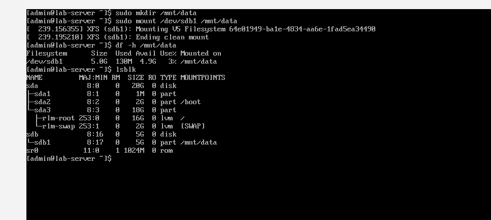
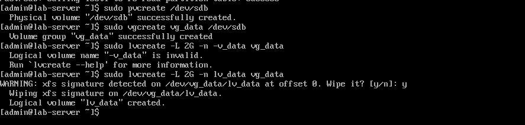
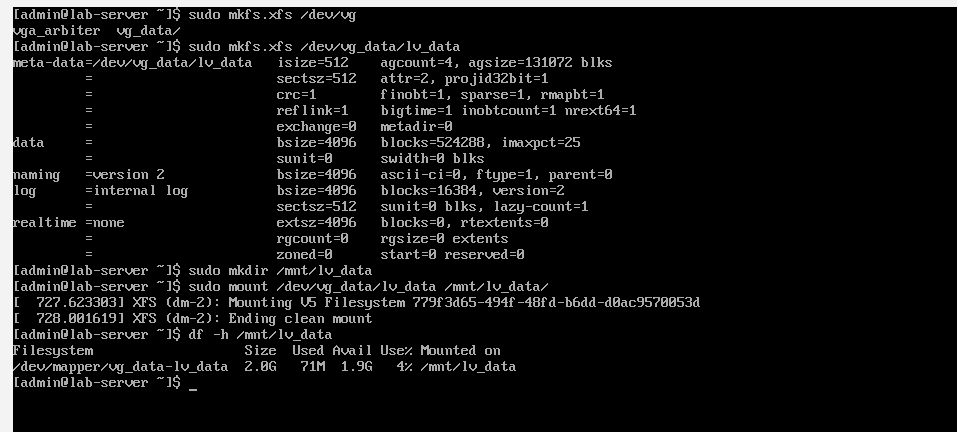
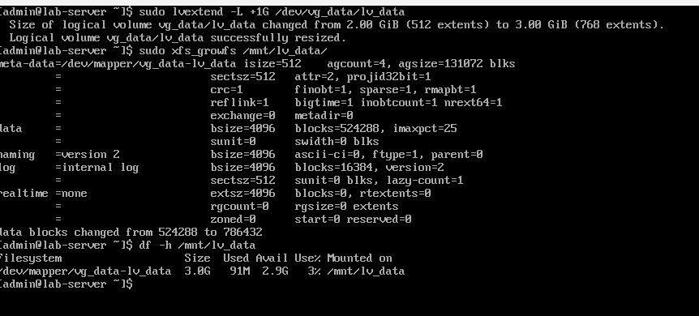
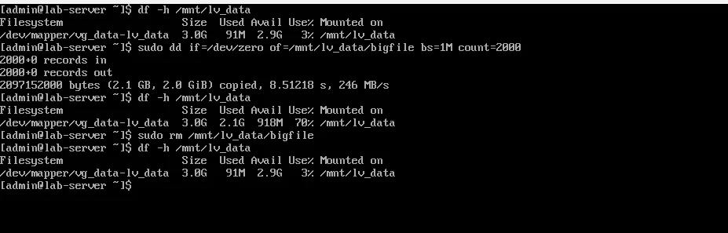

# Day 4: Storage & LVM

## Objective
To learn how to manage disks, partitions, and logical volumes — a critical skill for any Linux SysAdmin.

---

## Commands Used

| Command | Description |
|---------|-------------|
| `lsblk` | List block devices |
| `sudo fdisk /dev/sdb` | Partition a disk |
| `sudo mkfs.xfs /dev/sdb1` | Format a partition |
| `sudo pvcreate /dev/sdb` | Create a physical volume |
| `sudo vgcreate vg_data /dev/sdb` | Create a volume group |
| `sudo lvcreate -L 2G -n lv_data vg_data` | Create a logical volume |
| `sudo lvextend -L +1G /dev/vg_data/lv_data` | Extend a logical volume online |
| `sudo xfs_growfs /mnt/lv_data` | Extend an XFS filesystem |
| `sudo dd if=/dev/zero of=/mnt/lv_data/bigfile bs=1M count=2000` | Create a 2 GB dummy file |
| `sudo rm /mnt/lv_data/bigfile` | Remove the dummy file |
| `df -h /mnt/lv_data` | Check disk usage |

---

## Screenshots

### 1. Disk Detected and Partitioned

### 2. LVM Created and Mounted

### 3. Extending Logical Volume Online

### 4. Simulating a Full Disk and cleanup 

---

## Key Takeaways
- **LVM allows online extension** without unmounting or rebooting.
- Always use `xfs_growfs` for XFS filesystems.
- `lsblk` is your best friend for storage troubleshooting.
- `dd` is a powerful tool for creating dummy files and simulating full disks.
- Disk space issues are one of the most common production problems — knowing how to simulate, diagnose, and fix them is critical.

---

## Challenges Faced

### 1. Device Busy Error
- **Issue:** When trying to create a physical volume, I got `Can't open /dev/sdb1 exclusively. Mounted filesystem?`
- **Fix:** I unmounted the partition (`sudo umount /mnt/data`) and used `wipefs -a /dev/sdb` to remove the partition table, then created the PV on the whole disk.

### 2. Partitioned Disk
- **Issue:** `Cannot use /dev/sdb: device is partitioned`
- **Fix:** Used the whole disk for LVM instead of a partition (`/dev/sdb` instead of `/dev/sdb1`).

---

## Final Status
✅ **Day 4 Lab Complete**
- New disk added and detected
- Partition created
- Physical Volume, Volume Group, and Logical Volume created
- Filesystem formatted and mounted
- Logical volume extended online
- Dummy file created and deleted
- Disk space simulated and verified

---
