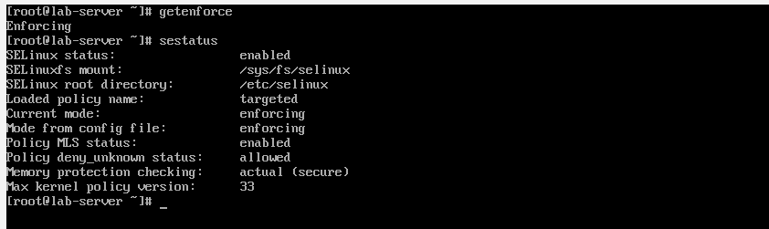
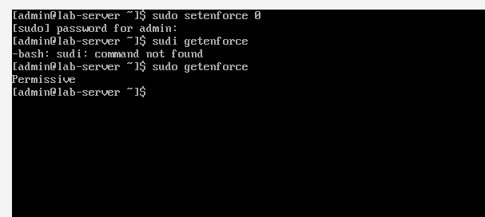
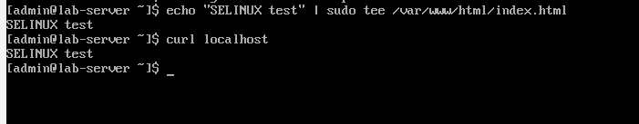
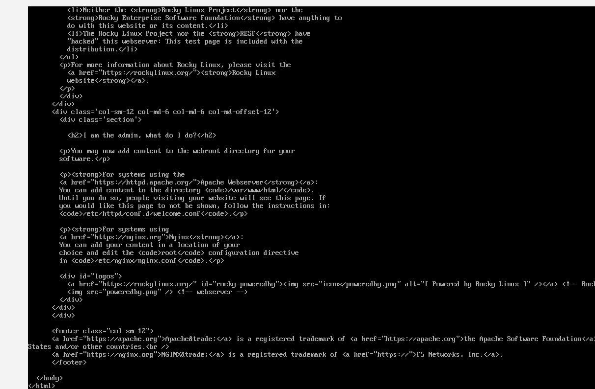
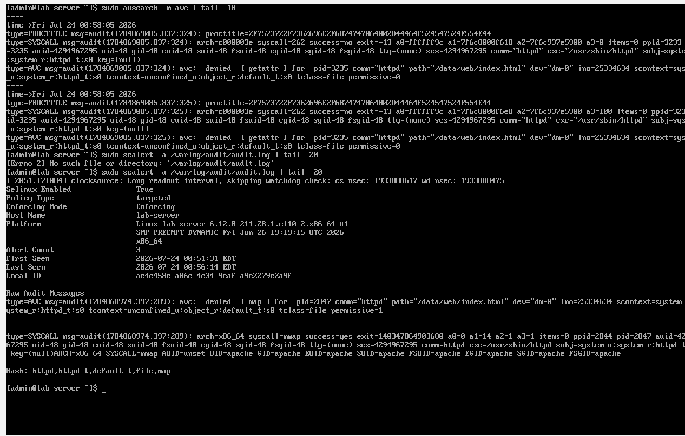
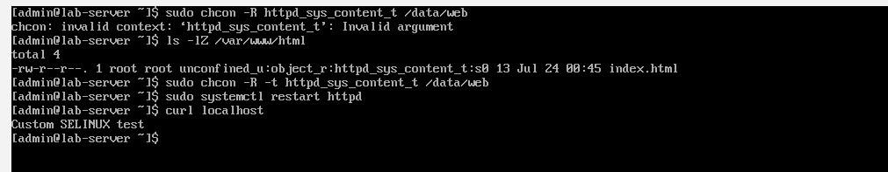
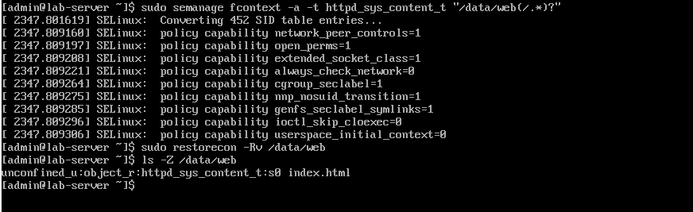

Day 6: SELinux Basics

Objective
To understand SELinux modes, contexts, and basic troubleshooting without disabling it.

Commands Used

| Command | Description |
|---------|-------------|
| `getenforce` | Check current SELinux mode |
| `sestatus` | Get detailed SELinux status |
| `sudo setenforce 0` | Switch to Permissive mode (temporary) |
| `sudo setenforce 1` | Switch to Enforcing mode (temporary) |
| `sudo dnf install -y setroubleshoot` | Install `sealert` for readable SELinux logs |
| `sudo sealert -a /var/log/audit/audit.log | tail -30` | Generate readable SELinux report |
| `sudo ausearch -m avc` | Check SELinux denial logs |
| `ls -Z` | Check SELinux context of a file/directory |
| `sudo chcon -R -t httpd_sys_content_t /data/web/` | Change SELinux context (temporary) |
| `sudo semanage fcontext -a -t httpd_sys_content_t "/data/web(/.*)?"` | Add permanent SELinux context |
| `sudo restorecon -Rv /data/web/` | Apply permanent context |

SELinux Modes

| Mode | What It Does | When to Use |
|------|--------------|-------------|
| Enforcing | Blocks unauthorized actions | Production systems |
| Permissive | Logs but does not block | Troubleshooting |
| Disabled | Completely off | Never in production |

Steps Performed

1. Checked SELinux Status
$ getenforce
Enforcing

$ sestatus
SELinux status:                 enabled
Current mode:                   enforcing

2. Switched to Permissive Mode
$ sudo setenforce 0
$ getenforce
Permissive

3. Installed Apache and Tested Default Root
$ sudo dnf install -y httpd
$ sudo systemctl start httpd
$ echo "SELinux Test" | sudo tee /var/www/html/index.html
$ curl localhost
SELinux Test

4. Created Custom Web Root and Triggered SELinux Denial
$ sudo setenforce 1
$ sudo systemctl restart httpd
$ curl localhost
curl: (56) Recv failure: Connection reset by peer

5. Checked SELinux Denials
$ sudo ausearch -m avc | tail -10

6. Installed setroubleshoot and Generated Readable Report
$ sudo dnf install -y setroubleshoot
$ sudo sealert -a /var/log/audit/audit.log | tail -30

7. Fixed SELinux Context (Temporary)
$ sudo chcon -R -t httpd_sys_content_t /data/web/
$ sudo systemctl restart httpd
$ curl localhost
Custom SELinux Test

8. Made Context Change Permanent
$ sudo semanage fcontext -a -t httpd_sys_content_t "/data/web(/.*)?"
$ sudo restorecon -Rv /data/web/
$ ls -Z /data/web/
unconfined_u:object_r:httpd_sys_content_t:s0 /data/web/index.html

## Screenshots

### 1. SELinux Status

### 2. Switching to Permissive Mode

### 3. Apache Working (Default Root)

### 4. 403 Forbidden (Enforcing Mode)

### 5. SELinux Denial Logs

### 6. Fix Context & Success

### 7. Permanent Context Applied

Observations

Enforcing vs Permissive Mode
- Enforcing Mode: SELinux blocked Apache from accessing `/data/web/index.html` and returned a 403 Forbidden error.
- Permissive Mode: SELinux logged the denial but allowed access. This confirmed that SELinux was the root cause of the issue.
- Fix Applied: Added the correct `httpd_sys_content_t` context to `/data/web/` to allow Apache to serve content without disabling SELinux.

sealert Command
- `sealert` is not installed by default on minimal Rocky Linux installations.
- It needs to be installed via `sudo dnf install -y setroubleshoot`.
- `sealert` translates SELinux denial logs into human-readable suggestions.

Key Takeaways
- SELinux has three modes: Enforcing, Permissive, and Disabled.
- Never disable SELinux in production — fix the context instead.
- Use `chcon` for temporary fixes and `semanage` for permanent changes.
- Always verify context with `ls -Z`.
- `sealert` is a powerful tool that translates SELinux denials into plain English.

Challenges Faced
- `sealert` was not installed by default. Fixed by installing `setroubleshoot`.
- Needed to switch to Enforcing mode to trigger the 403 Forbidden error for documentation.

Final Status
✅ Day 6 Lab Complete
- SELinux status checked and modes understood.
- Enforcing vs Permissive mode tested.
- SELinux denial triggered and identified.
- Context fixed temporarily and permanently.
- `sealert` installed and used for troubleshooting.
- All screenshots documented.

Next Steps
- Move to Day 7: Systemd & Services
