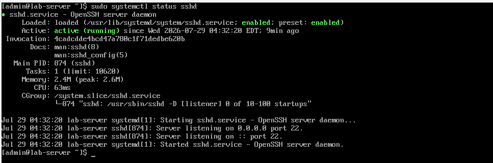
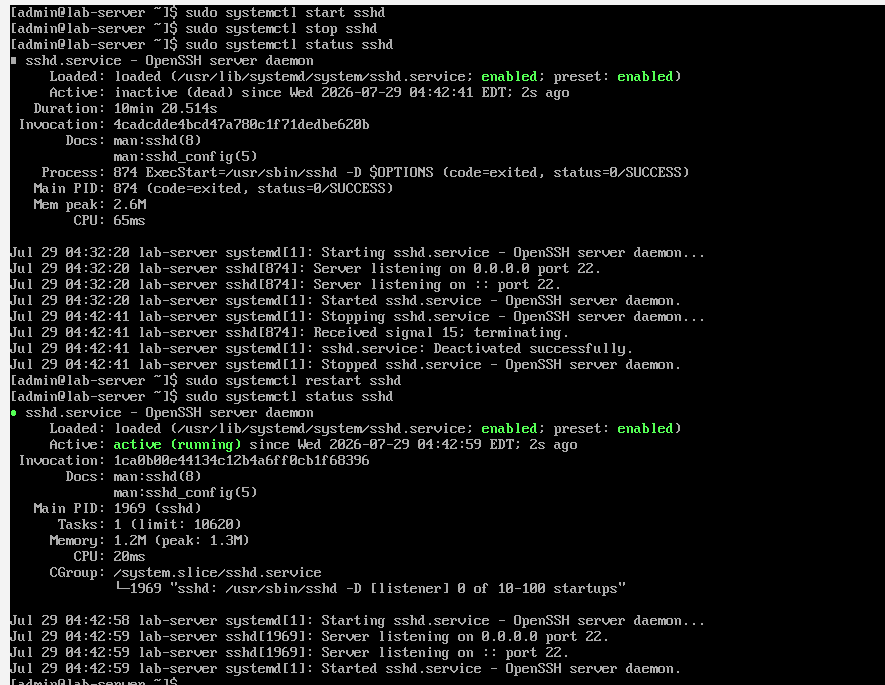
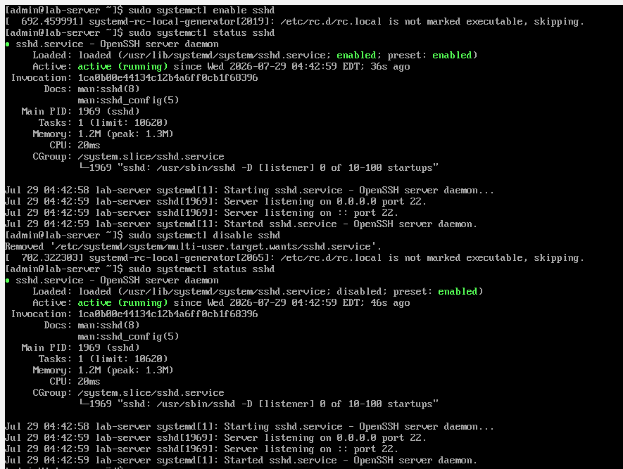
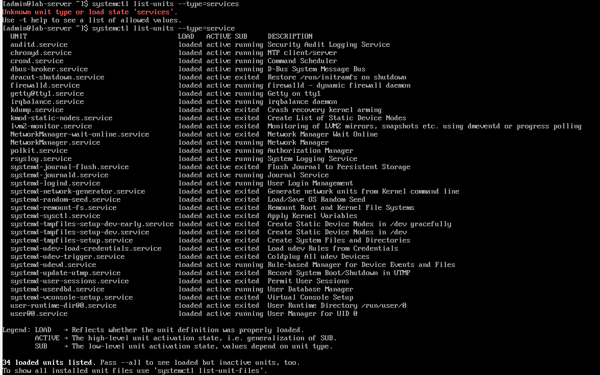
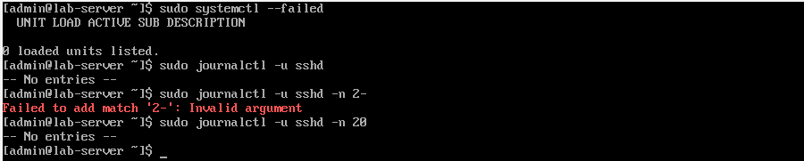
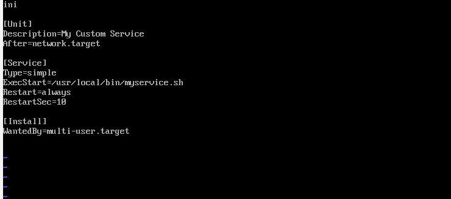
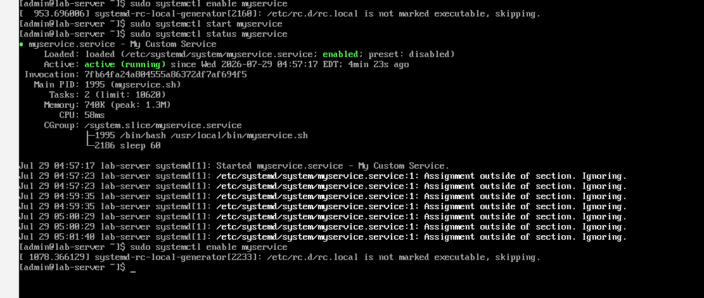
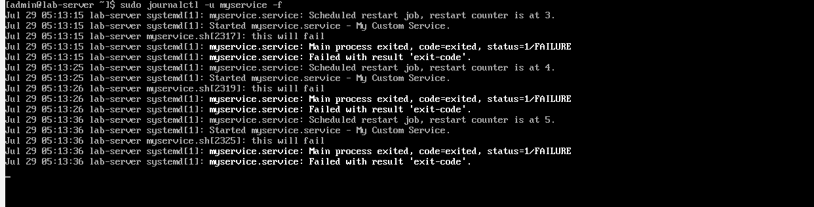
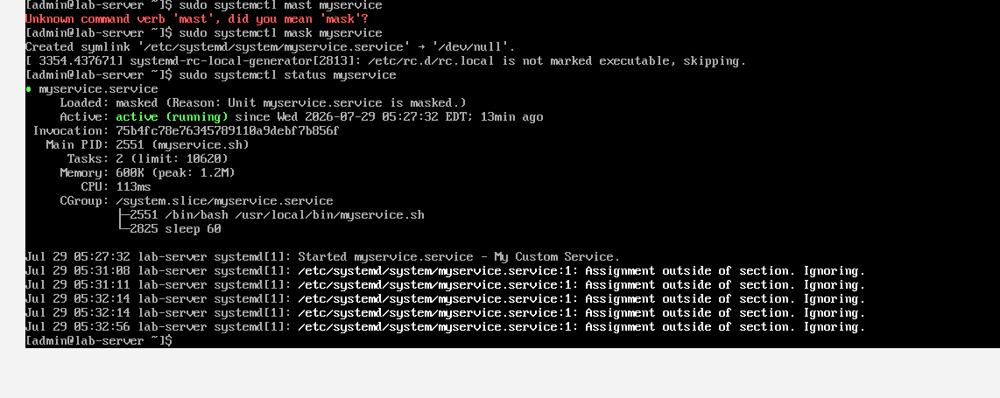
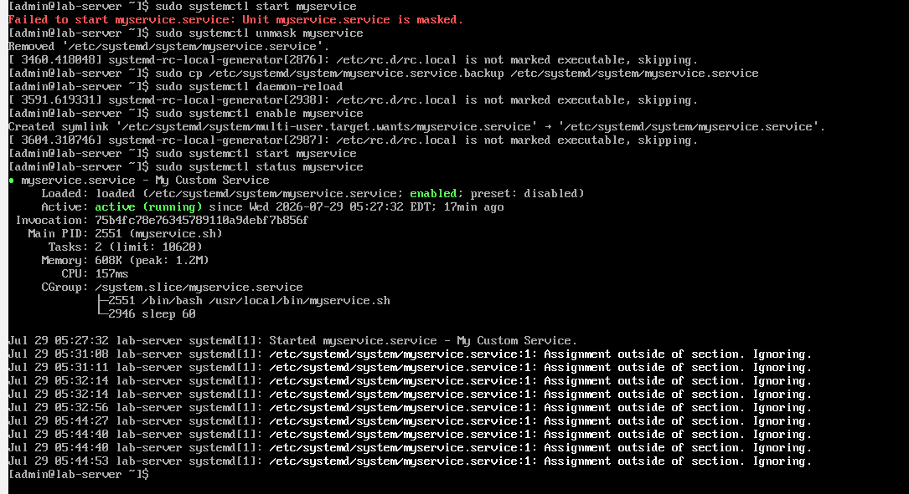

Day 7: Systemd & Services

Objective
To learn how to manage services using systemd — the default init system in modern Linux. Includes starting, stopping, enabling, disabling, masking, unmasking, and troubleshooting services.

Commands Used

| Command | Description |
|---------|-------------|
| `sudo systemctl status <service>` | Check service status |
| `sudo systemctl start <service>` | Start a service |
| `sudo systemctl stop <service>` | Stop a service |
| `sudo systemctl restart <service>` | Restart a service |
| `sudo systemctl enable <service>` | Enable service to start at boot |
| `sudo systemctl disable <service>` | Disable service from starting at boot |
| `sudo systemctl is-enabled <service>` | Check if service is enabled |
| `sudo systemctl list-units --type=service` | List all active services |
| `sudo systemctl --failed` | List all failed services |
| `sudo journalctl -u <service>` | View logs for a specific service |
| `sudo journalctl -f` | Follow logs in real-time |
| `sudo systemctl daemon-reload` | Reload systemd configuration |
| `sudo systemctl mask <service>` | Prevent a service from starting (even manually) |
| `sudo systemctl unmask <service>` | Remove a mask from a service |

Screenshots
## Service Status

This screenshot shows the current status of the SSH service using the `systemctl status sshd` command. The output confirms whether the service is active, inactive, or failed, along with additional details such as the process ID (PID), uptime, and recent log entries.

---

## Starting and Stopping a Service

In this step, the `systemctl start` and `systemctl stop` commands are used to control the SSH service. This demonstrates how to manually start a stopped service and stop a running service for maintenance or troubleshooting purposes.

---

## Enabling a Service

This screenshot demonstrates enabling the SSH service to start automatically during system boot using the `systemctl enable` command. This ensures the service is available even after the server is restarted.

---

## Listing Services

The `systemctl list-units --type=service` command is used to display all active services running on the system. This helps administrators verify service status and identify running system services.

---

## Viewing Service Logs

The `journalctl` command is used to view logs generated by the SSH service. These logs are useful for troubleshooting service issues and monitoring service activity.

---

## Custom Service Created

A custom systemd service unit file is created and saved under `/etc/systemd/system/`. This allows administrators to create their own services that can be managed using systemctl.

---

## Custom Service Running

After reloading the systemd daemon, the custom service is started successfully. The output confirms that the service is active and managed by systemd like any other system service.

---

## Troubleshooting a Failed Service

This screenshot shows a service in a failed state. The `systemctl status` and `journalctl` commands are used to identify the reason for the failure, helping troubleshoot configuration or execution issues.

---

## Masking and Unmasking a Service

The `systemctl mask` command prevents a service from being started, while `systemctl unmask` restores the ability to start it. This is useful when a service must be completely disabled.

---

## Final Service Status

The final screenshot verifies that all changes have been applied successfully and the service is running in the expected state. This confirms the completion of the lab exercise.

Steps Performed

1. Checked Service Status
$ sudo systemctl status sshd

2. Started, Stopped, and Restarted a Service
$ sudo systemctl start sshd
$ sudo systemctl stop sshd
$ sudo systemctl restart sshd

3. Enabled and Disabled a Service
$ sudo systemctl enable sshd
$ sudo systemctl disable sshd
$ sudo systemctl is-enabled sshd

4. Listed All Services
$ sudo systemctl list-units --type=service
$ sudo systemctl --failed

5. Viewed Service Logs
$ sudo journalctl -u sshd -n 20
$ sudo journalctl -u sshd -f

6. Created a Custom Service

Step 1: Created a script
$ sudo vi /usr/local/bin/myservice.sh

#!/bin/bash
while true; do
    echo "$(date) - My custom service is running" >> /var/log/myservice.log
    sleep 60
done

$ sudo chmod +x /usr/local/bin/myservice.sh

Step 2: Created a service unit file
$ sudo vi /etc/systemd/system/myservice.service

[Unit]
Description=My Custom Service
After=network.target

[Service]
Type=simple
ExecStart=/usr/local/bin/myservice.sh
Restart=always
RestartSec=10

[Install]
WantedBy=multi-user.target

Step 3: Reloaded and started the service
$ sudo systemctl daemon-reload
$ sudo systemctl start myservice
$ sudo systemctl enable myservice

7. Troubleshot a Failed Service

- Introduced an error in the script (missing #!/bin/bash)
- Service entered a failed state
- Used journalctl to diagnose the issue
- Fixed the script and restarted the service

$ sudo journalctl -u myservice -n 20
$ sudo systemctl restart myservice
$ sudo systemctl status myservice

8. Mask and Unmask a Service

- Disabled the service first
- Removed the service file
- Masked and unmasked the service

$ sudo systemctl disable myservice
$ sudo rm /etc/systemd/system/myservice.service
$ sudo systemctl daemon-reload
$ sudo systemctl mask myservice
$ sudo systemctl status myservice
$ sudo systemctl start myservice   # This should fail
$ sudo systemctl unmask myservice
$ sudo systemctl enable myservice
$ sudo systemctl start myservice
$ sudo systemctl status myservice

Observations

Disable vs Mask:
- Disable: Removes the symlink from multi-user.target.wants/. Service won't start at boot, but can be started manually.
- Mask: Links the service to /dev/null. Service cannot be started at all, even manually.

Custom Service:
- Service unit files go in /etc/systemd/system/.
- Always run systemctl daemon-reload after creating or modifying a unit file.
- Use Restart=always to ensure the service restarts if it crashes.

Key Takeaways
- systemctl is the primary tool for managing services.
- journalctl is used to view service logs.
- Disable = "Do not start at boot." Mask = "Cannot start at all."
- Always use systemctl daemon-reload after creating or modifying a service file.

Challenges Faced

1. Missing Shebang (#!/bin/bash)
- Issue: The service script failed because #!/bin/bash was missing at the top.
- Fix: Added #!/bin/bash to the script and made it executable (chmod +x).

2. Mask Conflict
- Issue: The service file already existed in /etc/systemd/system/, so masking failed.
- Fix: Disabled the service and removed the file before masking.

Final Status
✅ Day 7 Lab Complete
- Service status checked.
- Services started, stopped, restarted, enabled, and disabled.
- Custom service created and managed.
- Service logs viewed and followed.
- Failed service troubleshot and fixed.
- Service masked and unmasked.
