# RHEL 8.10 → RHEL 9.6 In-Place Upgrade Using Leapp

## Overview

This hands-on lab documents an **in-place upgrade from Red Hat Enterprise Linux (RHEL) 8.10 to RHEL 9.6** using **Leapp**.

**Environment:** Red Hat Interactive Lab  
**Source:** RHEL 8.10 (Ootpa)  
**Target:** RHEL 9.6 (Plow)  
**Tool:** Leapp

> This was a training/lab environment, not a production migration.

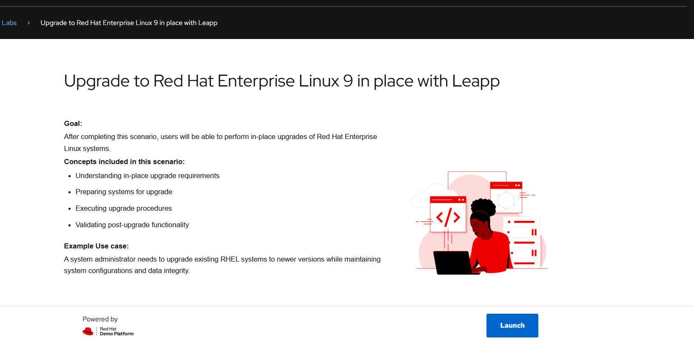

## 1. Baseline checks

Before upgrading, I verified the RHEL release, kernel, filesystem layout, and enabled repositories.

```bash
cat /etc/redhat-release
uname -r
df -h
lsblk
dnf repolist
```

The source system was RHEL 8.10 with RHEL 8 BaseOS and AppStream repositories.

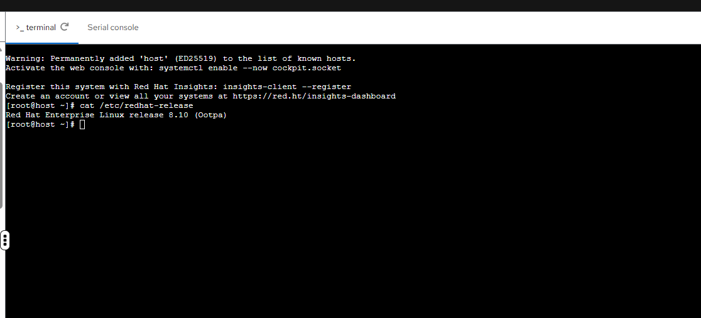

## 2. Update the source system

I updated RHEL 8 before starting the major-version upgrade:

```bash
dnf update -y
reboot
```

A reboot is important when an updated kernel is installed because installing a kernel does not automatically change the kernel currently running in memory.

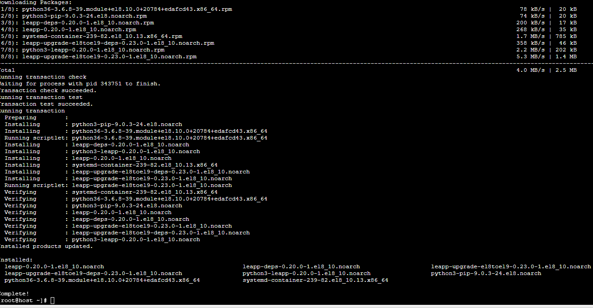

## 3. Install and verify Leapp

```bash
dnf install -y leapp-upgrade
leapp --version
```

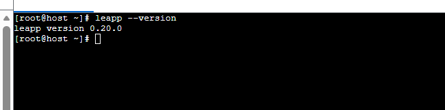

## 4. Run the pre-upgrade assessment

```bash
leapp preupgrade --target 9.6
```

`leapp preupgrade` assesses upgrade readiness without performing the actual OS upgrade. It checks packages, repositories, kernel state, drivers, boot configuration, authentication, storage, and other compatibility areas.

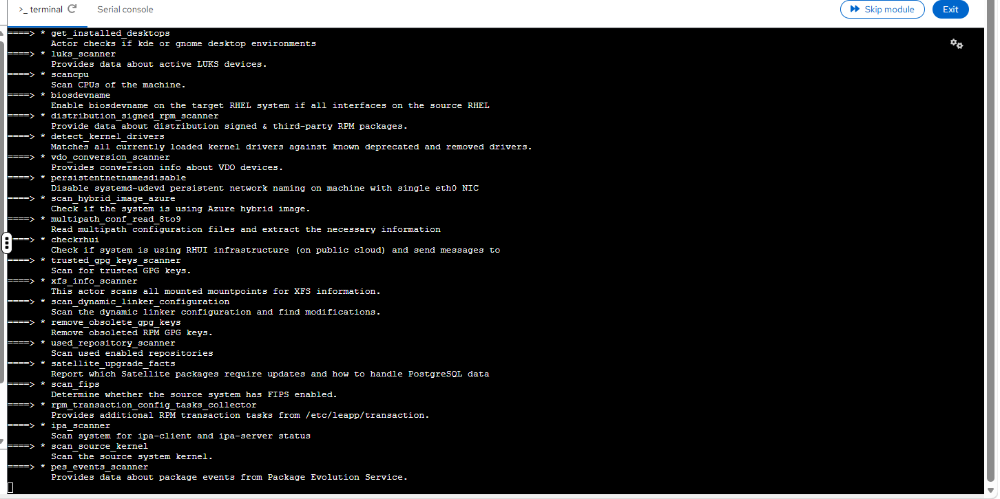

## 5. Review the Leapp report

Leapp generated its report under `/var/log/leapp/`.

```bash
cat /var/log/leapp/leapp-report.txt
```

The assessment found an **inhibitor**.

An inhibitor is a blocking issue that must be resolved before the upgrade can proceed. High/medium/low severity findings indicate risks or changes that should be reviewed, but they do not necessarily block the upgrade.

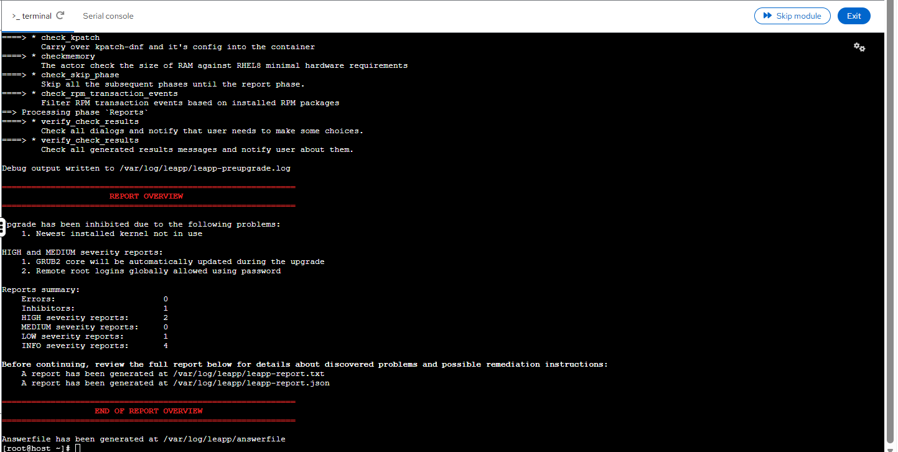

## 6. Troubleshoot the kernel inhibitor

The inhibitor was:

> **Newest installed kernel not in use**

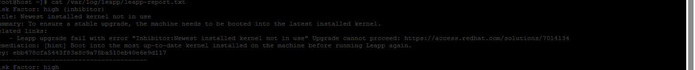

I compared the running kernel with all installed kernels:

```bash
uname -r
rpm -q kernel
```

I also checked the GRUB default:

```bash
grubby --default-kernel
```

The key distinction is:

- `rpm -q kernel` — lists installed kernel packages.
- `uname -r` — shows the kernel currently running.
- `grubby --default-kernel` — shows the kernel configured as the default boot kernel.

After rebooting into the newest installed kernel, the running and default kernel matched.

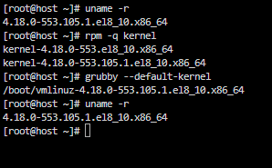

## 7. Check the Leapp answer file

```bash
cat /var/log/leapp/answerfile
ls -l /var/log/leapp/answerfile
```

In this run the answer file was `0` bytes, so Leapp had no outstanding administrator questions requiring an explicit answer.

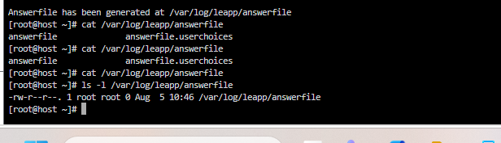

## 8. Perform the upgrade

After resolving blocking findings and rerunning the assessment, I proceeded with:

```bash
leapp upgrade --target 9.6
reboot
```

The reboot is part of completing the transition into RHEL 9.

## 9. Review the upgrade log

```bash
sudo less /var/log/leapp/leapp-upgrade.log
```

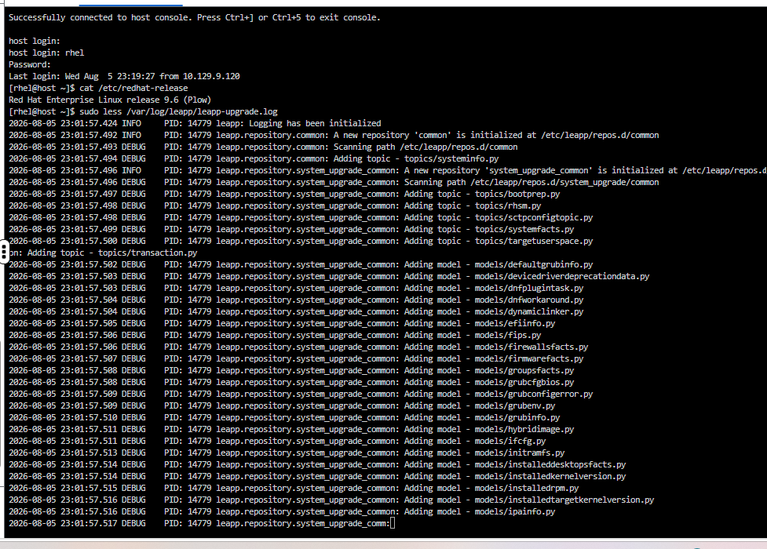

## 10. Post-upgrade validation

### OS and kernel

```bash
cat /etc/redhat-release
uname -r
```

Result:

- **RHEL 9.6 (Plow)**
- **5.14.x RHEL 9 kernel**

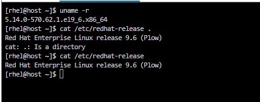

### Failed services

```bash
systemctl --failed
```

Result: **0 failed units**.

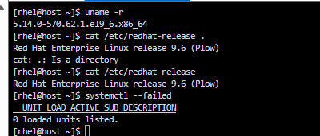

### Repositories

```bash
sudo dnf repolist
```

The system was using RHEL 9 BaseOS and AppStream repositories.

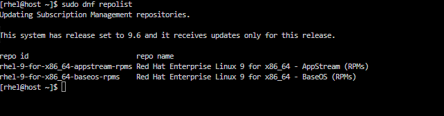

### Filesystem

```bash
df -h
```

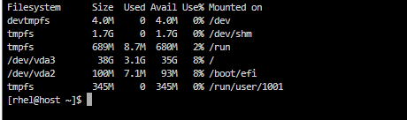

### Memory

```bash
free -m
```

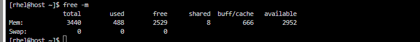

### Network interface and IP

```bash
ip addr
```

The primary interface was UP and had an IPv4 address.

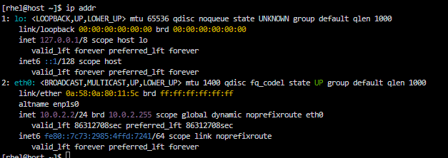

### Routing

```bash
ip route
```

In the lab:

- Network: `10.0.2.0/24`
- Server IP: `10.0.2.2`
- Default gateway: `10.0.2.1`

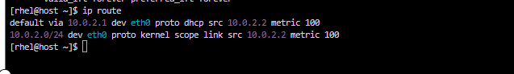

## Upgrade workflow

```text
RHEL 8.10
   |
   v
Baseline validation
   |
   v
dnf update + reboot
   |
   v
Install Leapp
   |
   v
leapp preupgrade --target 9.6
   |
   v
Review /var/log/leapp/leapp-report.txt
   |
   v
Resolve inhibitors
   |
   v
Re-run preupgrade assessment
   |
   v
leapp upgrade --target 9.6
   |
   v
Reboot
   |
   v
RHEL 9.6
   |
   v
Post-upgrade validation
```

## Key learning

The most useful troubleshooting scenario in this lab was the **“Newest installed kernel not in use”** inhibitor.

Rather than treating the upgrade as a single command, the exercise demonstrated the operational workflow:

**Assess → Analyze → Remediate → Reassess → Upgrade → Validate**

I also practiced:

- Leapp pre-upgrade assessments
- Reading Leapp reports and logs
- Understanding inhibitors versus severity findings
- Comparing installed and running kernels
- GRUB/default-kernel validation
- RHEL repository validation
- systemd health checks
- Filesystem and memory checks
- Network and routing validation

## Production considerations

For a production migration I would additionally validate:

- Supported RHEL upgrade path
- Backups/snapshots and tested rollback
- Application and third-party package compatibility
- Repository/subscription readiness
- Maintenance/change window
- Monitoring and application health
- Functional testing after the upgrade

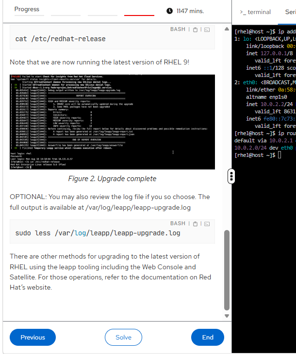

## Result

**Successfully completed a hands-on RHEL 8.10 → RHEL 9.6 in-place upgrade using Leapp and performed post-upgrade validation.**
